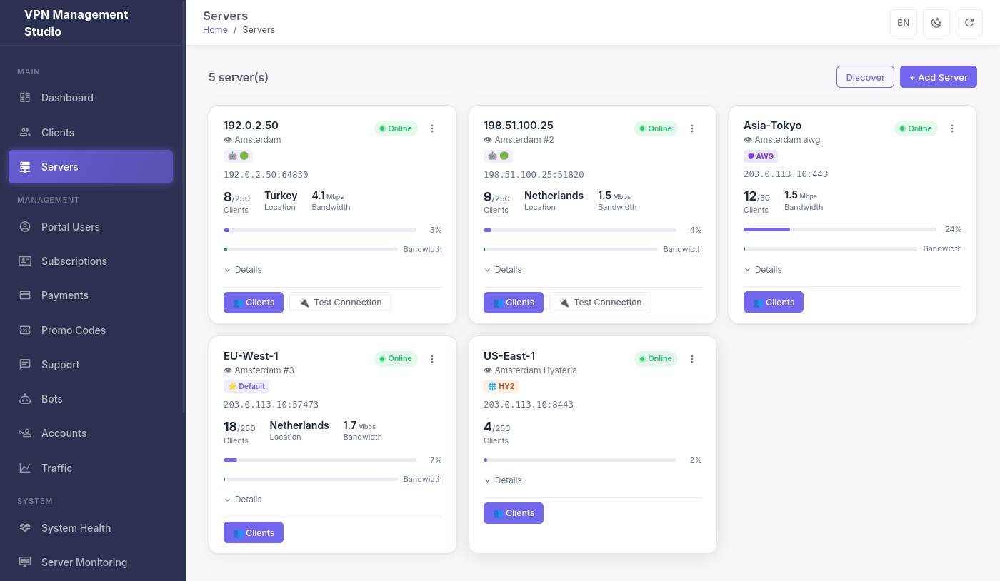
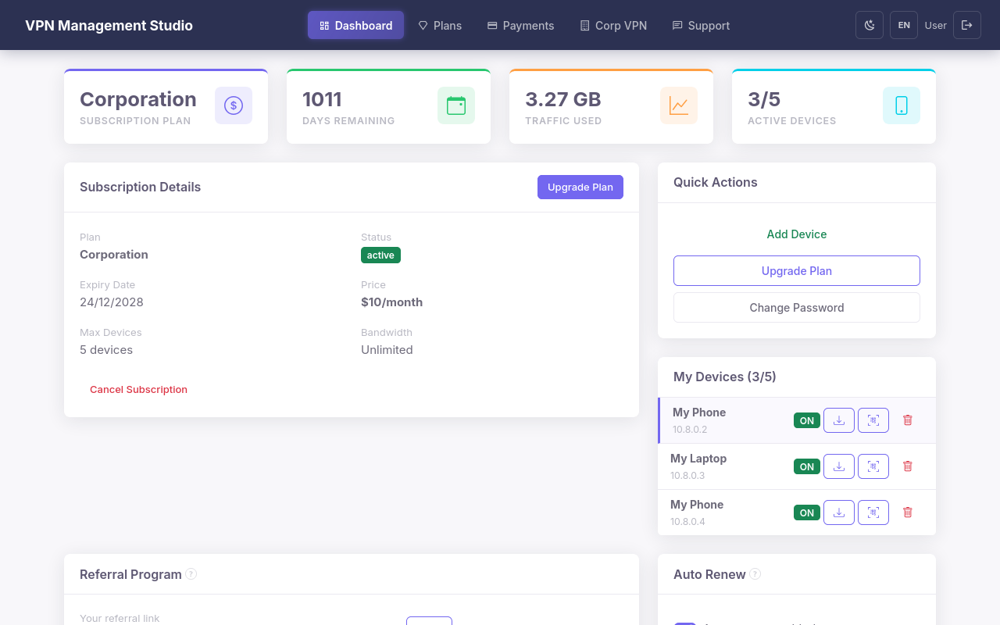
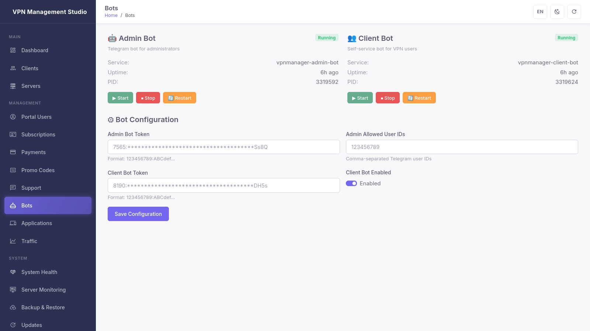

# Flirexa

**Self-hosted VPN management for WireGuard, AmneziaWG, Hysteria2, and TUIC.**
Open core under MIT. Paid plugins for the parts that turn it into a real business.

[](https://github.com/Flirexa/flirexa/actions/workflows/test.yml)
[](LICENSE)
[](https://github.com/Flirexa/flirexa/releases)
[](https://www.python.org/)
[](https://github.com/Flirexa/flirexa/stargazers)

```bash
# One command on a fresh Ubuntu 22.04+ / Debian 12 server:
curl -fsSL https://flirexa.biz/install.sh | sudo bash
```


---

## Run a real VPN service. Today.

Flirexa is what you'd build if you took Marzban, gave it a working client portal, and made the multi-server / corporate / white-label parts a paid upgrade instead of unfinished issues.

**For yourself or a few friends?** Run the FREE tier and never look at this README again.
**Selling VPN as a service?** Free tier handles up to 80 clients on one server with crypto payments out of the box. When you outgrow it, you upgrade — the same software, more features unlocked.

No telemetry. No phone-home. No license check on FREE. No kill switch.

---

## What you get for free

| | |
|---|---|
| **Protocols** | WireGuard + AmneziaWG (DPI-resistant — works in censorship-heavy networks) |
| **Capacity** | Up to 80 clients on 1 server, no expiry |
| **Admin panel** | Vue 3 SPA on port 10086 — real-time stats, traffic graphs, QR codes |
| **Client portal** | Separate FastAPI process on port 10090 — self-service signup, plans, config download |
| **Telegram** | Admin bot for managing the service from your phone |
| **Payments** | NOWPayments (BTC, ETH, USDT, XMR, +50 cryptocurrencies) out of the box |
| **Languages** | English, Русский, Українська, Deutsch, Français, Español |
| **Updates** | Auto-pull from GitHub Releases, no phone-home |
| **Backup** | Manual export/restore with full data |
| **Plugins** | Drop-in payment providers (Stripe, Mollie, Razorpay, Payme, CryptoPay, NOWPayments) |

If you can run a VPS, you can run a VPN service.

---

## Screenshots

<table>
<tr>
<td width="50%">

**Admin dashboard**


</td>
<td width="50%">

**Client management**


</td>
</tr>
<tr>
<td width="50%">

**Multi-server view**


</td>
<td width="50%">

**Client portal**


</td>
</tr>
<tr>
<td width="50%">

**Telegram bots**


</td>
<td width="50%">

**Settings & branding**


</td>
</tr>
</table>

---

## What's paid

The paid plugins live in `plugins/<name>/` as license-gated declarations. Without a valid license the plugin loader skips them and the corresponding API endpoints return **403** with a clear upgrade hint. With a license they activate automatically — no separate install, no different binary.

| Tier | Per month | Plugins unlocked |
|---|---|---|
| **Starter** | $19 | `extra-protocols` (Hysteria2, TUIC), `promo-codes` (codes + auto-renewal) |
| **Business** | $49 | + `multi-server`, `client-tg-bot`, `traffic-rules`, `white-label-basic`, `auto-backup` |
| **Enterprise** | $149 | + `corporate-vpn` (site-to-site mesh), `manager-rbac` (multi-admin RBAC) |

Pricing and licensing: [flirexa.biz](https://flirexa.biz)

> **Why open-core?** The self-hosted VPN management space has good free tools (Marzban, Hiddify, 3X-UI) and good closed tools — but very little in between. Flirexa is what we wished existed: a genuinely useful free product that small operators can grow with, plus paid plugins for serious commercial operators who need multi-server, white-label, and B2B features.

---

## Compared to alternatives

| | **Flirexa FREE** | Marzban | Hiddify | WG-Easy | 3X-UI |
|---|:---:|:---:|:---:|:---:|:---:|
| WireGuard | ✓ | ❌ (V2Ray-style) | ✓ | ✓ | ❌ |
| AmneziaWG | **✓** | ❌ | ✓ | ❌ | ❌ |
| Hysteria2 | paid | ✓ | ✓ | ❌ | ✓ |
| TUIC | paid | ✓ | ✓ | ❌ | ✓ |
| Web admin panel | ✓ | ✓ | ✓ | ✓ | ✓ |
| Client portal w/ payments | ✓ | ❌ | partial | ❌ | ❌ |
| Telegram admin bot | ✓ | community plugin | ✓ | ❌ | community plugin |
| Built-in crypto payments | **✓ (NOWPayments)** | ❌ | ❌ | ❌ | ❌ |
| Multi-server orchestration | paid | ✓ | ✓ | ❌ | ❌ |
| Site-to-site Corporate VPN | paid (Enterprise) | ❌ | ❌ | ❌ | ❌ |
| White-label branding | paid | ❌ | partial | ❌ | ❌ |
| Auto-updates from upstream | ✓ | manual | ✓ | manual | manual |
| 6-language UI | **✓** | ✓ | ✓ | partial | ✓ |
| Open source license | MIT | AGPL-3.0 | GPL-3.0 | MIT | GPL-3.0 |

The matrix above isn't "we're better than everyone." It's "we made different trade-offs." Marzban is excellent if you live entirely in the V2Ray ecosystem. Hiddify is excellent if you want a polished single-server panel. WG-Easy is excellent if you just want WireGuard for yourself and your family. **Flirexa is what you pick if you want to run VPN as a small business.**

---

## Install

### Quick install (Ubuntu 22.04+ / Debian 12+)

```bash
curl -fsSL https://flirexa.biz/install.sh | sudo bash
```

The installer sets up Python venv, PostgreSQL, systemd services, generates secrets, and runs the first migrations. Admin panel is at `http://<your-server-ip>:10086` afterwards. First login creates the admin account.

### From source

```bash
git clone https://github.com/Flirexa/flirexa.git
cd flirexa
python3 -m venv venv
source venv/bin/activate
pip install -r requirements.txt
cp .env.example .env  # edit as needed
alembic upgrade head
python main.py
```

### Docker

```bash
git clone https://github.com/Flirexa/flirexa.git
cd flirexa
docker compose up -d
```

See [docs/installation.md](docs/installation.md) for details, alternative database setups, and TLS / domain config.

---

## API

The admin API is a documented FastAPI app. After install:

- **Swagger UI:** `http://<your-server-ip>:10086/docs`
- **OpenAPI schema:** `http://<your-server-ip>:10086/openapi.json`
- **Architecture overview:** [docs/architecture.md](docs/architecture.md)
- **API reference:** [docs/api.md](docs/api.md)

REST endpoints are grouped by domain (`/api/v1/clients`, `/api/v1/servers`, `/api/v1/payments`, …). Authentication is JWT via `/api/v1/auth/login`. The client portal API at `/client-portal/*` uses a separate JWT scope for end-user accounts.

---

## Plugins

The plugin system is open and documented. To write a community plugin:

1. Copy `plugins/_example/` to `plugins/<your-plugin-name>/`.
2. Edit `manifest.json` (kebab-case `name`, semver `version`).
3. Set `requires_license_feature` to a feature flag your installs always have. For community plugins (no license gate), use `community` — the plugin loader treats it as universally granted.
4. Implement your plugin in `__init__.py` — export a `PLUGIN` instance subclassing `src.modules.plugin_loader.Plugin`.
5. Restart the API.

See [docs/plugins.md](docs/plugins.md) for the full plugin authoring guide and [plugins/_example/](plugins/_example/) for a working scaffold.

---

## Documentation

| Topic | Where |
|---|---|
| Getting started | [docs/getting-started.md](docs/getting-started.md) |
| Installation (full reference) | [docs/installation.md](docs/installation.md) |
| Architecture overview | [docs/architecture.md](docs/architecture.md) |
| API reference | [docs/api.md](docs/api.md) |
| Plugin authoring | [docs/plugins.md](docs/plugins.md) |
| FREE vs paid (what's gated, what's not) | [docs/free-vs-paid.md](docs/free-vs-paid.md) |
| Licensing model | [docs/licensing.md](docs/licensing.md) |
| Updates & rollback | [docs/updates.md](docs/updates.md) |
| Backup & disaster recovery | [docs/backup-restore.md](docs/backup-restore.md) |
| Troubleshooting | [docs/troubleshooting.md](docs/troubleshooting.md) |
| Roadmap | [ROADMAP.md](ROADMAP.md) |
| Changelog | [CHANGELOG.md](CHANGELOG.md) |

---

## Roadmap

Active items, in rough order. See [ROADMAP.md](ROADMAP.md) for the full picture.

- **2026 Q2** — Subscription billing on `flirexa.biz` (Stripe + recurring NOWPayments)
- **2026 Q2** — Signed plugin distribution from license server (paid plugins as `.tar.gz` packages)
- **2026 Q3** — Public demo instance (`demo.flirexa.biz`)
- **2026 Q3** — Plugin marketplace (community-authored plugins)
- **2026 Q4** — Mobile app (Android/iOS) for client-side config management

---

## Support the project

If Flirexa saves you time or money, consider:

- ⭐ **Starring this repository** — costs nothing, helps massively with visibility.
- 💬 **Telling us what worked / what didn't** — open an issue or [discussion](https://github.com/Flirexa/flirexa/discussions).
- 💖 **Sponsoring on GitHub** — *coming soon*.
- ₿ **Crypto donations** for one-off contributions:

  | Currency | Network | Address |
  |---|---|---|
  | Bitcoin (BTC) | Bitcoin | `bc1qpznnfvrvnnz7g4na7kcd69c48c79yxgfjappf0` |
  | Ethereum (ETH) | Ethereum | `0xc9428847bf4a741c946cfc33a726a293fd97cc07` |
  | USDT | Ethereum (ERC-20) | `0xc9428847bf4a741c946cfc33a726a293fd97cc07` |
  | USDT | Tron (TRC-20) | `TGGQrmJqsjmbnieXhfeRBMyUML3zGWKY3x` |

If you want commercial support (priority response, custom integrations, training): `support@flirexa.biz`.

---

## Contributing

PRs and issues welcome. Read [CONTRIBUTING.md](CONTRIBUTING.md) and [SECURITY.md](SECURITY.md) first — they explain what we accept, what we don't, and how to set up a dev environment.

For commercial enquiries (pricing, support contracts, white-label OEM): `support@flirexa.biz`.

---

## License

MIT — see [LICENSE](LICENSE).

The contents of this repository (the open core) are MIT-licensed. The paid plugins distributed by the official Flirexa license server are closed-source and shipped under a separate commercial license tied to your subscription. See [docs/licensing.md](docs/licensing.md) for the full breakdown.
