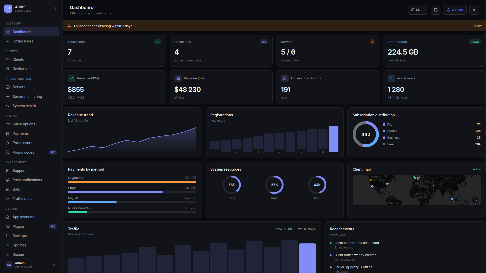
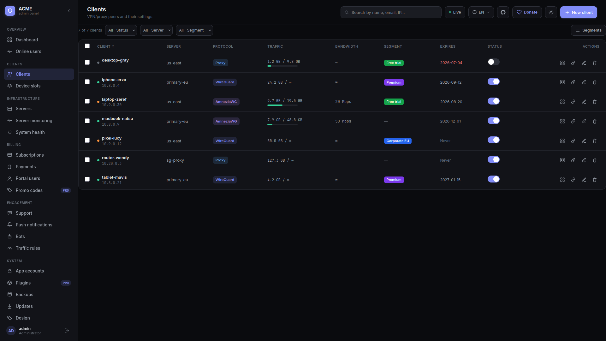
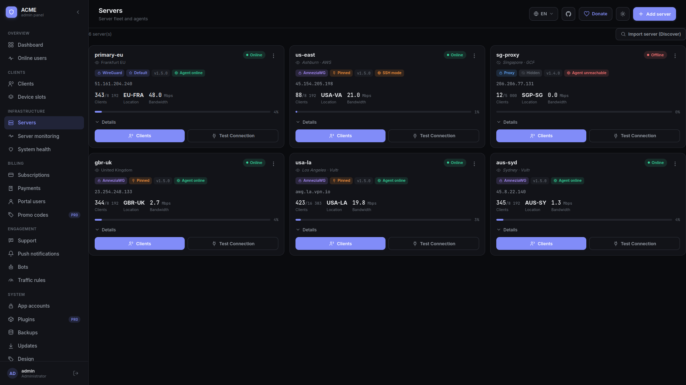
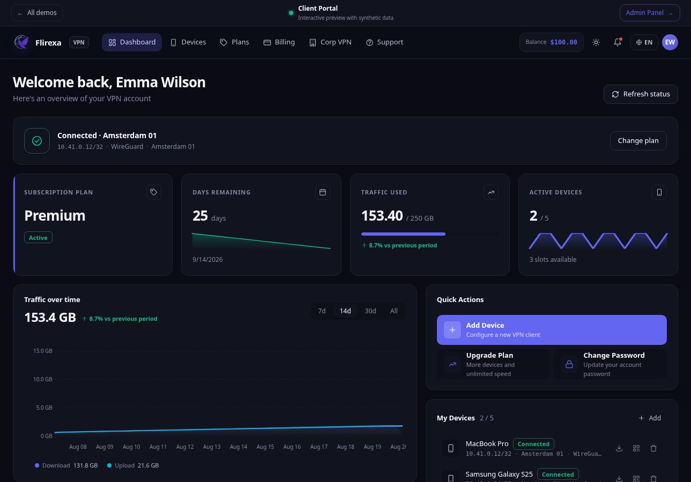
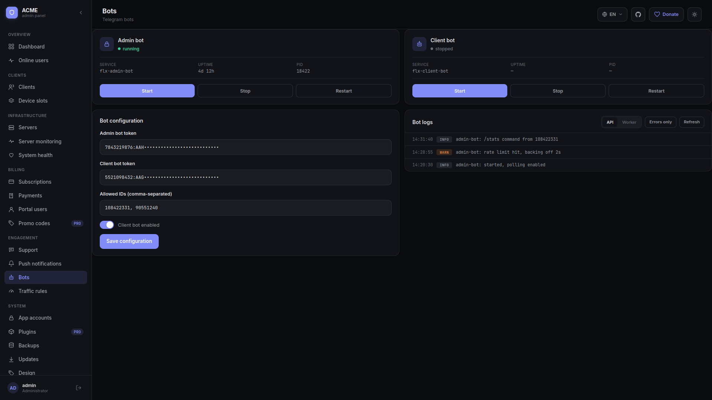
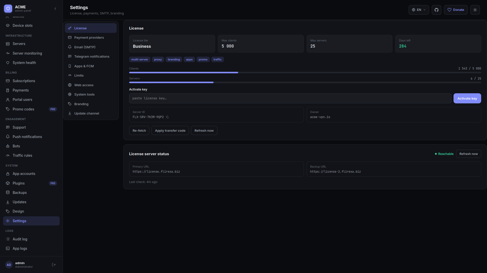

# Flirexa

## Launch and operate your own VPN service on infrastructure you control

Flirexa brings the admin panel, customer portal, subscriptions, payments,
multi-server operations, and five VPN protocols into one self-hosted platform.
Start on one server, then add locations from the same panel as your service
grows.

The public open core is MIT-licensed. Commercial plans add protected business
features, higher limits, white-label controls, and customer applications.

_Product claims last verified: 2026-08-18. The checkout on
[flirexa.biz](https://flirexa.biz) is authoritative for current prices and
billing periods._

[Website](https://flirexa.biz) ·
[Interactive demo](https://flirexa.biz/demo/VPN-Admin-Panel-demo.html?theme=dark&lang=en) ·
[Pricing](https://flirexa.biz/#pricing) ·
[Documentation](docs/getting-started.md) ·
[Enterprise trial](https://flirexa.biz/#pricing)

[](https://github.com/Flirexa/flirexa/actions/workflows/test.yml)
[](LICENSE)
[](https://github.com/Flirexa/flirexa/releases)
[](https://www.python.org/)



## What one guided installation gives you

- A responsive admin panel for customers, servers, traffic, subscriptions,
  payments, backups, and system health
- A separate customer portal for registration, purchases, device slots,
  configuration delivery, and support
- PostgreSQL, generated secrets, system services, migrations, and health checks
- The first local WireGuard and AmneziaWG endpoints
- Signed updates with checksum verification, backup, rollback, and release
  channels
- An admin Telegram bot for operational work away from the browser

You still choose the VPS, domain, payment accounts, prices, and brand. Flirexa
does not resell connectivity or place customer traffic on a third-party VPN
network.

```bash
# Supported production hosts: Ubuntu Server 22.04 or 24.04, x86-64
curl -fsSL https://flirexa.biz/install.sh | sudo bash
```

The installer checks the host, explains any unsupported optional component,
deploys the services, and prints the access details when verification passes.
See the [installation reference](docs/installation.md) before using an existing
server with custom firewall, web, or database configuration.

## Built for operators, not just tunnel configuration

Flirexa is useful when the work extends beyond creating a WireGuard peer. It
keeps customer access, plan limits, payments, device slots, server state, and
support workflows in one operational model.

It is designed for:

- founders launching a self-hosted VPN service
- existing VPN operators replacing manual account and configuration work
- hosting companies and MSPs adding a managed VPN product
- teams that need branded customer access on infrastructure they control
- organizations managing many VPN locations from one panel

## Free tier

The FREE tier has no expiry, paid licence heartbeat, or remote kill switch.

| Capability | Included |
|---|---|
| Protocols | WireGuard and AmneziaWG |
| Capacity | Up to 80 customers |
| Deployment | One physical host, with one local endpoint per included protocol |
| Admin panel | Customers, traffic, QR codes, plans, payments, backups, and updates |
| Customer portal | Registration, plans, checkout, device configuration, and account management |
| Payments | NOWPayments cryptocurrency checkout |
| Telegram | Admin bot |
| Languages | English, Russian, Ukrainian, German, French, and Spanish |
| Backups | Manual backup and restore |
| Source | MIT-licensed public open core |

The installer can report coarse phase and failure diagnostics so failed
installations can be supported. Set `INSTALL_TELEMETRY=off` to disable that
diagnostic flow. The signed updater still contacts the update service when an
operator requests or schedules an update check.

## Commercial plans

Paid capabilities are enforced by signed feature flags and backend checks.
Official releases supply protected commercial implementations; this public
repository contains the open core and explicit compatibility boundaries.

| Plan | From | Best for | Added capabilities |
|---|---:|---|---|
| Starter | $12/month | A small service that needs more protocols | Hysteria2, TUIC, VLESS-Reality, promo codes, up to 500 customers |
| Business | $49/month | A growing multi-location VPN business | Up to 10 managed servers and 2,000 customers, full payment-provider suite, customer Telegram bot, traffic rules, scheduled backups, prepaid customer balance, per-device DNS protection |
| Enterprise | $149/month | A full branded service or large network | Unlimited servers and customers, full white-label controls, manager RBAC, advanced DNS policy, corporate site-to-site VPN, standard Android/Windows/Linux client apps |

Business DNS protection lets the operator configure four resolver modes and
optionally let each customer choose a mode per device. Enterprise adds custom
profiles and enforced policies by plan, segment, customer, or device. Flirexa
writes the selected resolver address into the generated configuration; the
operator runs or selects the DNS resolvers.

Business and Enterprise also support prepaid customer credit. Provider-confirmed
top-ups use exact-cent accounting and an append-only ledger. Customers can pay
for a subscription from their balance, while administrator adjustments require
a reason and are audit-logged.

Monthly and annual licences renew until cancelled. Lifetime, when offered for
the selected tier, is a one-time purchase and includes future standard product
updates. Every paid purchase includes one month of daily onboarding help from
the purchase date, followed by priority ticket support.

[Compare every plan and gate](docs/free-vs-paid.md) ·
[Read the licensing model](docs/licensing.md) ·
[View current checkout pricing](https://flirexa.biz/#pricing)

## Product tour

<table>
<tr>
<td width="50%">

**Customer management**


</td>
<td width="50%">

**Multi-server operations**


</td>
</tr>
<tr>
<td width="50%">

**Separate customer portal**


</td>
<td width="50%">

**Telegram workflows**


</td>
</tr>
<tr>
<td width="50%">

**Settings and branding**


</td>
<td width="50%">

**Operational dashboard**


</td>
</tr>
</table>

The mobile admin interface does not squeeze desktop tables into a narrow
viewport. Operational lists use compact summary rows, expandable details, and
touch-sized actions. Desktop views remain information-dense.

## Protocols and server growth

- **WireGuard** and **AmneziaWG** are included in FREE
- **Hysteria2**, **TUIC**, and **VLESS-Reality** start with Starter
- Remote-node orchestration starts with Business
- Add Server can bootstrap and verify a compatible remote VPN node from the
  main panel
- Business supports up to 10 servers; Enterprise removes the server limit

Protocol support and orchestration are separate concerns. Starter expands the
protocol set on the installation host. Business adds the remote locations and
central operations needed to grow a network.

## Payments and subscriptions

FREE includes NOWPayments. Business and Enterprise can use the commercial
payment-provider suite, including Stripe, PayPal, PayLio, CryptoPay, Mollie,
Razorpay, and Payme where supported by the operator's provider account and
region.

Checkout grants access only after the provider reports a matching settled
payment. The return page alone is never treated as proof of payment. Automatic
end-customer renewal is temporarily unavailable while it is being rebuilt
around one newly verified provider settlement per extension; manual checkout
and renewal remain supported.

## API and integrations

Flirexa exposes a documented FastAPI admin API and OpenAPI schema on every
installation. Endpoints are grouped by operational domain, including
customers, servers, payments, subscriptions, backups, and support.

- [API reference](docs/api.md)
- [Architecture](docs/architecture.md)
- [Plugin authoring](docs/plugins.md)
- [Payment setup](docs/payment-setup.md)

Admin API clients use Bearer authentication. Browser customer-portal sessions
use short-lived HttpOnly access cookies, rotating hash-only refresh families,
and CSRF protection. Official mobile applications retain the compatible Bearer
contract.

## Install from source

```bash
git clone https://github.com/Flirexa/flirexa.git
cd flirexa
python3 -m venv venv
source venv/bin/activate
pip install -r requirements.lock
cp .env.example .env
alembic upgrade head
python main.py
```

For Docker development and evaluation:

```bash
git clone https://github.com/Flirexa/flirexa.git
cd flirexa
docker compose up -d
```

The guided installer is the supported production path. Source and Docker
flows are intended for contributors and operators who understand the manual
configuration they introduce.

## Documentation

| Topic | Guide |
|---|---|
| First installation | [Getting started](docs/getting-started.md) |
| Production installation | [Installation reference](docs/installation.md) |
| FREE and paid boundaries | [FREE vs paid](docs/free-vs-paid.md) |
| Pricing and plan limits | [Pricing](docs/pricing.md) |
| Licence activation and transfer | [Licensing](docs/licensing.md) |
| Updates and rollback | [Updates](docs/updates.md) |
| Backup and recovery | [Backup and restore](docs/backup-restore.md) |
| API | [API reference](docs/api.md) |
| Plugins | [Plugin guide](docs/plugins.md) |
| Troubleshooting | [Troubleshooting](docs/troubleshooting.md) |
| Security reports | [Security policy](SECURITY.md) |
| Product direction | [Roadmap](ROADMAP.md) |

## Open core and commercial boundary

The public repository contains a functional MIT-licensed VPN management core.
Commercial implementations are distributed separately under their own licence
and still require the matching signed entitlement at runtime. Native packaging
raises the cost of copying paid modules, but Flirexa does not present client-side
protection on a root-controlled server as an absolute barrier.

Existing paid keys keep capabilities explicitly present in their signed
feature set. An official update preserves the database, environment, licence
state, limits, and feature flags while replacing managed application files.

## Contributing and support

Issues and pull requests are welcome. Read [CONTRIBUTING.md](CONTRIBUTING.md)
and [SECURITY.md](SECURITY.md) before opening one. Use
[GitHub Discussions](https://github.com/Flirexa/flirexa/discussions) for product
questions and community ideas.

For licensing, onboarding, white-label, and commercial integration questions,
email [support@flirexa.biz](mailto:support@flirexa.biz).

## Licence

The public repository is available under the [MIT License](LICENSE).
Separately delivered commercial components are covered by their own licence
terms. See [docs/licensing.md](docs/licensing.md) for the boundary.
